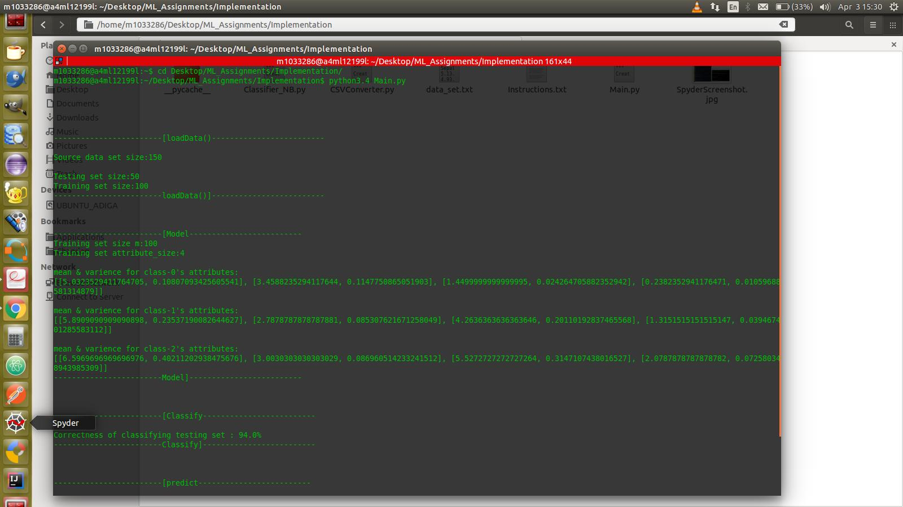

# Naive Bayes Classifier demo using Iris DataSet

[Instructions](Instructions.txt)

[Sample Data Set](Implementation/data_set.txt) - Source: [Wikipedia](https://en.wikipedia.org/wiki/Iris_flower_data_set)

[Report](Report.pdf)

------
### Screenshot: Spyder Editor

------
### Screenshot: Terminal

